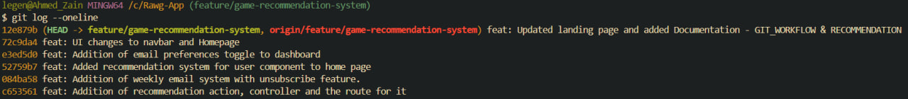
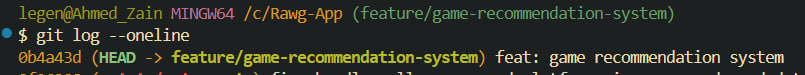

# Git Workflow Documentation

## Workflow Overview

This feature was developed using a feature branch workflow to keep the main branch stable while building the recommendation system.

### Steps Followed

1. Switched to main branch and pulled latest changes
2. Created a new feature branch: `feature/game-recommendation-system`
3. Pushed the branch to GitHub to track it remotely
4. Developed the feature with multiple commits throughout development
5. Squashed all commits into a single commit before PR submission
6. Force pushed the squashed commit using `--force-with-lease`
7. Opened a PR requesting review — not merged to main

### Branch Commands Used
```bash
# Create and switch to feature branch
git checkout -b feature/game-recommendation-system

# Push branch to GitHub
git push -u origin feature/game-recommendation-system

# Regular commits during development
git add .
git commit -m "descriptive message"
git push

# Squash commits before PR
git rebase -i HEAD~[number of commits]

# Force push after squash
git push --force-with-lease
```

## Commit Squashing

All commits made during development were squashed into a single commit using interactive rebase:
```bash
git rebase -i HEAD~[number of commits]
```

In the interactive editor, all commits except the first were marked as `squash` (or `s`). The final commit message was set to:
```
feat: game recommendation system
```

### Screenshots (These are in screenshots folder)

Before squashing.



After squashing.

