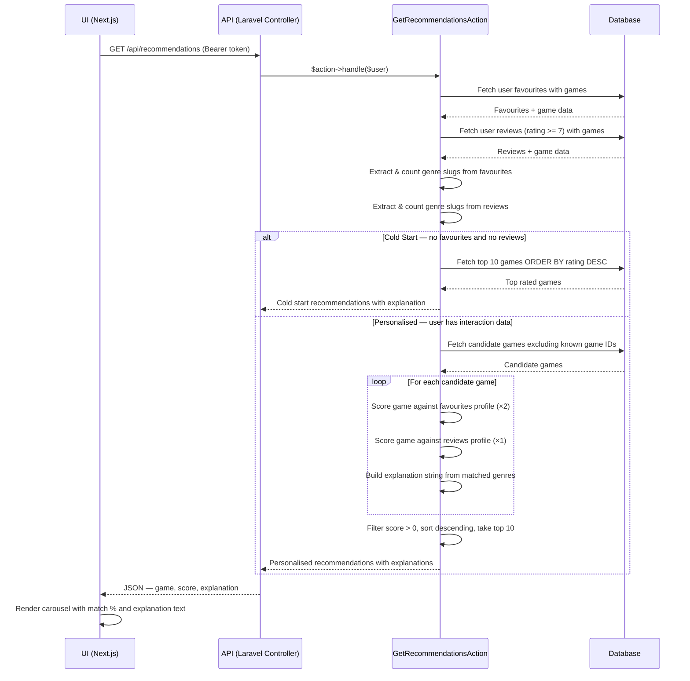

# Rule-Based Game Recommendation System

## How It Works

The recommendation system analyses a user's existing interactions with the platform — specifically their favourited games and their highly-rated reviews — to build a profile of their genre preferences. It then scores every other game in the database against that profile and returns the top 10 matches, each accompanied by a human-readable explanation string.

No machine learning is used. The system is entirely deterministic — given the same user data, it will always produce the same recommendations.

## Recommendation Strategies

### Strategy 1: Favourites-Based Similarity

The system looks at all games a user has added to their favourites list and extracts the genre slugs from each game. It then counts how many times each genre appears across all favourited games — so if a user has favourited 4 Action games and 1 RPG game, Action carries more weight.

When scoring candidate games, each genre match against the favourites profile contributes `count × 2` points to the game's score. The ×2 multiplier reflects that explicitly saving a game to favourites is a stronger signal of preference than simply rating it.

### Strategy 2: Review-Based Similarity

The system looks at all reviews a user has submitted with a rating of 7 or above (out of 10). Games rated below 7 are intentionally excluded — a low rating signals dislike, which should not influence recommendations positively.

Genre slugs are extracted from these highly-rated games and counted. When scoring candidate games, each genre match against the review profile contributes `count × 1` point to the score.

### Combined Scoring

Both strategies run together. A candidate game's final score is the sum of points from both strategies. This means a game that matches both a user's favourited genres AND their highly-reviewed genres will score higher than one that only matches one strategy.
```
final_score = (favourites_genre_count × 2) + (reviews_genre_count × 1)
```

Games with a score of 0 (no genre overlap at all) are filtered out entirely before returning results.

## Cold Start Handling

The cold start problem occurs when a user has no favourites and no reviews — meaning there is no data to base personalised recommendations on.

In this case the system detects that both genre profiles are empty and falls back to a simple popularity-based approach: it fetches the top 10 highest rated games in the database, ordered by their RAWG rating. Each game receives the explanation string:
```
"Trending this week based on overall ratings"
```

This ensures new users always receive meaningful recommendations from the moment they register, even before they interact with any games.

## Explainability

Every recommended game includes an explanation string that tells the user why it was recommended. These strings are generated from the matched genres:

| Scenario | Example Explanation |
|---|---|
| Matched favourited genres | "Because you enjoy Action and RPG games" |
| Matched reviewed genres only | "Based on your highly rated Adventure games" |
| No genre match (fallback) | "Popular among users with similar taste" |
| Cold start | "Trending this week based on overall ratings" |

The explanation always uses at most 2 genre names to keep the string concise and readable.

## Laravel Action Pattern

All recommendation logic lives in `app/Actions/GetRecommendationsAction.php`. The controller (`RecommendationController`) is intentionally thin — it simply receives the authenticated request, instantiates the Action, calls `handle($user)`, and returns the JSON response.

This separation means the same Action can be reused in multiple places without duplicating logic. For example, both the API endpoint and the weekly email job call the same `GetRecommendationsAction::handle()` method.
```
RecommendationController  ──→  GetRecommendationsAction::handle()
                                           ↑
SendWeeklyRecommendations  ───────────────┘
```

## Sequence Diagram


## API Response Shape
```json
[
  {
    "game": {
      "id": 14,
      "name": "Persona 5 Royal",
      "slug": "persona-5-royal",
      "rating": "4.75",
      "genres": [{ "id": 5, "name": "RPG", "slug": "role-playing-games-rpg" }],
      "background_image": "https://..."
    },
    "score": 12,
    "explanation": "Because you enjoy RPG and Adventure games"
  }
]
```